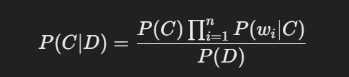
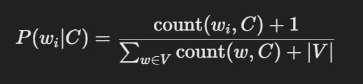
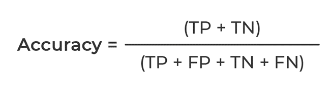
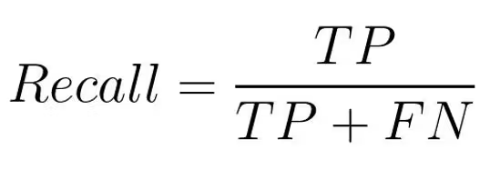
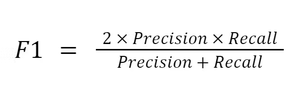

# Classificateur Naive Bayes  📊🤖

## Description 📜

Ce projet démontre l'implémentation d'un **classificateur Naive Bayes** pour la classification de textes en Java. Il traite un **corpus** de documents textuels organisés par classe et applique la **validation croisée en K-fold** pour l'évaluation. Le modèle est entraîné sur un ensemble de documents et prédit la classe des documents de test. Les principales métriques d'évaluation incluent **la précision**, **le rappel**, **le score F1** et **l'accuracy**.

---

## Structure du Projet 🗂️

```
/src
    /com/test
        /CorpusReader.java
        /DataPreProcessing.java
        /DataSpliter.java
        /NaiveBayes.java
        /Evaluation.java
        /Main.java
        /Reformate.java
/Corpus_init
    /classeA
        /doc1
        /doc2
    /classeB
        /doc3
    ...
/Corpus
    /doc1-classeA-fold
    /doc2-classeA-fold
    /doc3-classeB-fold
    ...
/StopwordsEn.txt
```

- **Reformate.java** : Reformate le corpus en renommant les fichiers en fonction du numéro du fold et de la classe, puis les déplace dans un nouveau répertoire pour la validation croisée en K-fold.
- **CorpusReader.java** : Lit et traite le corpus à partir des fichiers. Chaque fichier contient un document dont la classe est extraite du nom du fichier.
- **DataPreProcessing.java** : Effectue le prétraitement du texte en supprimant les mots vides (stopwords) et en appliquant un algorithme de racinisation (stemming).
- **DataSpliter.java** : Divise les données en ensembles d'entraînement et de test en fonction du numéro de fold spécifié dans le nom du fichier. Il gère aussi la création des ensembles d'entraînement et de test pour la validation croisée en K-fold.
- **NaiveBayes.java** : Implémente le classificateur Naive Bayes pour la classification de texte. Cela inclut l'entraînement du modèle et la prédiction.
- **Evaluation.java** : Calcule les métriques d'évaluation (précision, rappel, score F1, accuracy) pour évaluer la performance du modèle.
- **Main.java** : La classe principale qui orchestre la lecture du corpus, le prétraitement, l'entraînement du modèle et son évaluation via la validation croisée en K-fold.

---

## Fonctions Clés 🔧

### 1. **Reformate.java** :
- `renameAndMoveFiles(rootDirectoryPath, destinationDirectoryPath, n)` : Reformate le jeu de données en renommant les fichiers pour inclure le numéro du fold et la classe, puis les déplace dans un nouveau répertoire pour la validation croisée en K-fold.

### 2. **CorpusReader.java** :
- `readCorpus(corpusPath, classLabels)` : Lit les fichiers du corpus, extrait la classe du nom du fichier, et retourne une carte des documents avec leurs labels de classe.

### 3. **DataPreProcessing.java** :
- `preprocess(text)` : Prétraite le texte en supprimant les stopwords et en appliquant la racinisation.
- `stem(word)` : Applique l'algorithme de racinisation de Porter pour réduire les mots à leur racine.

### 4. **DataSpliter.java** :
- `splitByFold(corpus, classLabels, testFold)` : Divise le corpus en ensembles d'entraînement et de test en fonction du numéro du fold.
- `getUniqueFolds(corpus)` : Retourne un ensemble des numéros de fold uniques extraits des noms des fichiers du corpus.

### 5. **NaiveBayes.java** :
- `train(trainSet, classLabels)` : Entraîne le modèle Naive Bayes en utilisant l'ensemble d'entraînement et calcule les probabilités a priori et conditionnelles des classes.
- `predict(text)` : Prédit la classe d'un texte donné en fonction du modèle entraîné.

### 6. **Evaluation.java** :
- `evaluate(classifier, testSet, classLabels)` : Calcule et affiche les métriques d'évaluation (précision, rappel, score F1, accuracy) pour le modèle sur l'ensemble de test en utilisant la technique de k-fold cross validation.


---

## Formules Mathématiques 🧮

### Formule de Naive Bayes 🧑‍🏫

Le classificateur Naive Bayes utilise la formule suivante pour calculer la probabilité qu'un document appartienne à une classe donnée :



Où :
- \( P(C | D) \) est la probabilité de la classe \( C \) étant donné le document \( D \).
- \( P(C) \) est la probabilité a priori de la classe \( C \).
- \( P(w_i | C) \) est la probabilité du mot \( w_i \) étant donné la classe \( C \).
- \( P(D) \) est la probabilité d'observer le document \( D \) (qui est ignorée dans la classification).

#### Lissage de Laplace :
Lorsque le mot \( w_i \) n'a pas été observé dans les données d'entraînement, on applique un lissage de Laplace pour éviter que \( P(w_i | C) \) soit égal à zéro :




Où :
- \( \text{count}(w_i, C) \) est la fréquence du mot \( w_i \) dans la classe \( C \).
- \( |V| \) est la taille du vocabulaire.

---

## Métriques d'Évaluation 📈

- **Accuracy** :
- 
----

- **Précision (Precision)** :
- 
----

- **Rappel (Recall)** :
- 
----

- **Score F1** :
- 
----

---

## Utilisation 🚀

1. **Préparer le jeu de données** :
    - Exécutez la classe `Reformate` pour reformater le corpus dans la structure de dossiers souhaitée et divisez-le en folds.

2. **Exécuter le programme** :
    - Compilez et exécutez la classe `Main.java` pour démarrer l'entraînement et l'évaluation.
    - Le programme affichera les métriques d'évaluation (précision, rappel, score F1, accuracy) pour chaque fold de la validation croisée en K-fold.

---

## Dépendances 📦

- Java 8 ou supérieur
- Apache Commons Lang (pour les fonctions utilitaires comme `StringUtils`)
- Snowball stemmer (pour la racinisation en anglais)

---
